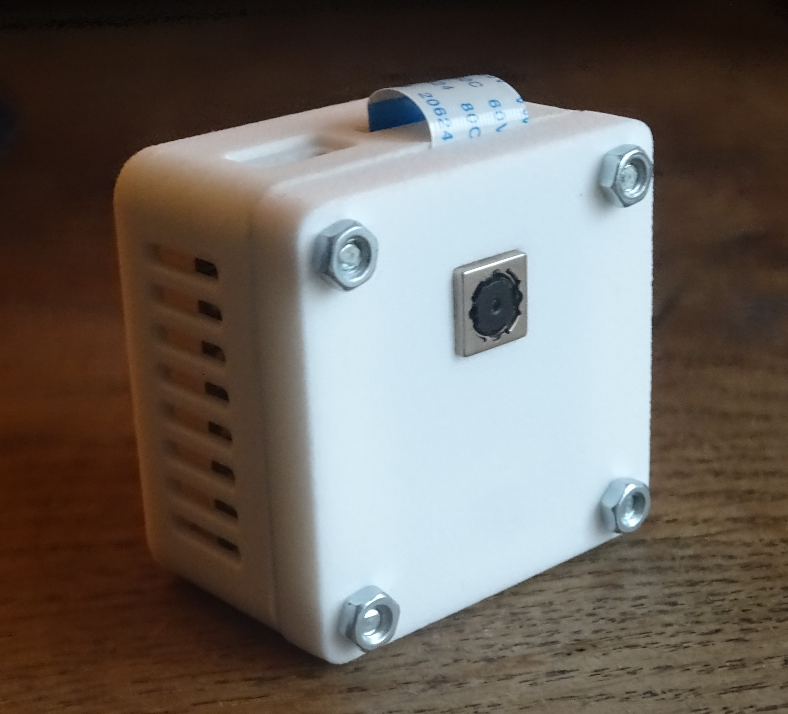
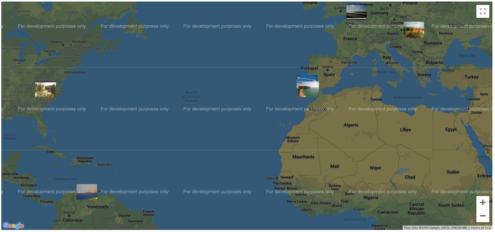
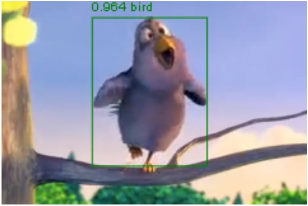

WebRTC-streamer
===============

WebRTC-streamer is an experiment to stream video capture devices and RTSP sources through WebRTC using simple mechanism.  

It embeds a HTTP server that implements API and serves a simple HTML page that use them through AJAX.   

The WebRTC signaling is implemented through HTTP requests:

 - /api/call   : send offer and get answer
 - /api/hangup : close a call

 - /api/addIceCandidate : add a candidate
 - /api/getIceCandidate : get the list of candidates

The list of HTTP API is available using /api/help.

Nowdays there is builds on [CircleCI](https://circleci.com/gh/mpromonet/webrtc-streamer), [Appveyor](https://ci.appveyor.com/project/mpromonet/webrtc-streamer), [CirrusCI](https://cirrus-ci.com/github/mpromonet/webrtc-streamer) and [GitHub CI](https://github.com/mpromonet/webrtc-streamer/actions) :
 * for x86_64 on Ubuntu Bionic
 * for armv7 crosscompiled (this build is running on Raspberry Pi2 and NanoPi NEO)
 * for armv6+vfp crosscompiled (this build is running on Raspberry PiB and should run on a Raspberry Zero)
 * for arm64 crosscompiled
 * Windows x64 build with clang
 * MacOS
 
The webrtc stream name could be :
 * an alias defined using -n argument then the corresponding -u argument will be used to create the capturer
 * an "rtsp://" url that will be openned using an RTSP capturer based on live555
 * an "file://" url that will be openned using an MKV capturer based on live555
 * an "screen://" url that will be openned by webrtc::DesktopCapturer::CreateScreenCapturer 
 * an "window://" url that will be openned by webrtc::DesktopCapturer::CreateWindowCapturer 
 * an "v4l2://" url that will capture H264 frames and store it using webrtc::VideoFrameBuffer::Type::kNative type (obviously not supported on Windows)
 * a capture device name

Dependencies :
-------------
It is based on :
 * [WebRTC Native Code Package](http://www.webrtc.org) for WebRTC
 * [civetweb HTTP server](https://github.com/civetweb/civetweb) for HTTP server
 * [live555](http://www.live555.com/liveMedia) for RTSP/MKV source

Build
===============
Install the Chromium depot tools (for WebRTC).
-------
	pushd ..
	git clone https://chromium.googlesource.com/chromium/tools/depot_tools.git
	export PATH=$PATH:`realpath depot_tools`
	popd

Download WebRTC 
-------
	mkdir ../webrtc
	pushd ../webrtc
	fetch --no-history webrtc 
	popd
	

Build WebRTC Streamer
-------
	cmake . && make 

It is possible to specify cmake parameters WEBRTCROOT & WEBRTCDESKTOPCAPTURE :
 - $WEBRTCROOT/src should contains source (default is $(pwd)/../webrtc) 
 - WEBRTCDESKTOPCAPTURE enabling desktop capture if available (default is ON) 

Usage
===============
	./webrtc-streamer [-H http port] [-S[embeded stun address]] -[v[v]]  [url1]...[urln]
	./webrtc-streamer [-H http port] [-s[external stun address]] -[v[v]] [url1]...[urln]
	./webrtc-streamer -V
        	-v[v[v]]           : verbosity
        	-V                 : print version

        	-H [hostname:]port : HTTP server binding (default 0.0.0.0:8000)
		-w webroot         : path to get files
		-c sslkeycert      : path to private key and certificate for HTTPS
		-N nbthreads       : number of threads for HTTP server
		-A passwd          : password file for HTTP server access
		-D authDomain      : authentication domain for HTTP server access (default:mydomain.com)

		-S[stun_address]                   : start embeded STUN server bind to address (default 0.0.0.0:3478)
		-s[stun_address]                   : use an external STUN server (default:stun.l.google.com:19302 , -:means no STUN)
		-t[username:password@]turn_address : use an external TURN relay server (default:disabled)
		-T[username:password@]turn_address : start embeded TURN server (default:disabled)
		
		-a[audio layer]                    : spefify audio capture layer to use (default:0)		
		-q[filter]                         : spefify publish filter (default:.*)
		-o                                 : use null codec (keep frame encoded)

		-C config.json                     : load urls from JSON config file 
		-R [Udp port range min:max]        : Set the webrtc udp port range (default 0:65535)

		-n name -u videourl -U audiourl    : register a name for a video url and an audio url
		[url]                              : url to register in the source list

Arguments of '-H' are forwarded to option [listening_ports](https://github.com/civetweb/civetweb/blob/master/docs/UserManual.md#listening_ports-8080) of civetweb, then it is possible to use the civetweb syntax like `-H8000,9000` or `-H8080r,8443s`.

Using `-o` allow to store compressed frame from backend stream using `webrtc::VideoFrameBuffer::Type::kNative`. This Hack the stucture `webrtc::VideoFrameBuffer` storing data in a override of i420 buffer. This allow to forward H264 frames from V4L2 device or RTSP stream to WebRTC stream. It use less CPU and have less adaptation (resize, codec, bandwidth are disabled).

Examples
-----
	./webrtc-streamer rtsp://wowzaec2demo.streamlock.net/vod/mp4:BigBuckBunny_115k.mov

[Live Demo](https://webrtc-streamer.herokuapp.com/)

We can access to the WebRTC stream using [webrtcstreamer.html](https://github.com/mpromonet/webrtc-streamer-html/blob/master/webrtcstreamer.html) for instance :

 * https://webrtc-streamer.herokuapp.com/webrtcstreamer.html?rtsp://wowzaec2demo.streamlock.net/vod/mp4:BigBuckBunny_115k.mov
 * https://webrtc-streamer.herokuapp.com/webrtcstreamer.html?Bunny

An example displaying grid of WebRTC Streams is available using option "layout=<lines>x<columns>"

[Live Demo](https://webrtc-streamer.herokuapp.com/?layout=2x4)

Using embedded STUN/TURN server behind a NAT:
===============

It is possible start embeded ICE server and publish its url using:

    ./webrtc-streamer -S0.0.0.0:3478 -s$(curl -s ifconfig.me):3478
    ./webrtc-streamer -s- -T0.0.0.0:3478 -tturn:turn@$(curl -s ifconfig.me):3478
    ./webrtc-streamer -S0.0.0.0:3478 -s$(curl -s ifconfig.me):3478 -T0.0.0.0:3479 -tturn:turn@$(curl -s ifconfig.me):3479
The command `curl -s ifconfig.me` is getting the public IP, it could also given as a static parameter.

In order to configure the NAT rules using the upnp feature of the router, it is possible to use [upnpc](https://manpages.debian.org/unstable/miniupnpc/upnpc.1.en.html) like this:

    upnpc -r 8000 tcp 3478 tcp 3478 udp
Adapting with the HTTP port, STUN port, TURN port.

Embed in a HTML page:
===============
Instead of using the internal HTTP server, it is easy to display a WebRTC stream in a HTML page served by another HTTP server. The URL of the webrtc-streamer to use should be given creating the [WebRtcStreamer](http://htmlpreview.github.io/?https://github.com/mpromonet/webrtc-streamer-html/blob/master/jsdoc/WebRtcStreamer.html) instance :

	var webRtcServer      = new WebRtcStreamer(<video tag>, <webrtc-streamer url>);

A short sample HTML page using webrtc-streamer running locally on port 8000 :

	<html>
	<head>
	
	
	
	</head>
	<body> 
	    <video id="video" />
	</body>
	</html>

Using WebComponent
==================
Using web-component could be a simple way to display some webrtc stream, a minimal page could be :

	<html>
	<head>
        
	</head>
	<body>
	   <webrtc-streamer url="rtsp://wowzaec2demo.streamlock.net/vod/mp4:BigBuckBunny_115k.mov"></webrtc-streamer>
	</body>
	</html>

[Live Demo](https://webrtc-streamer.herokuapp.com/Bunny.html)  

Using the webcomponent with a stream selector :

[Live Demo](https://webrtc-streamer.herokuapp.com/webrtc-streamer-element.html)

Using the webcomponent over google map :

[Live Demo](https://webrtc-streamer.herokuapp.com/map.html)

Object detection using tensorflow.js
===============

[Live Demo](https://webrtc-streamer.herokuapp.com/tensorflow.html)

Connect to Janus Gateway Video Room
===============
A simple way to publish WebRTC stream to a [Janus Gateway](https://janus.conf.meetecho.com) Video Room is to use the [JanusVideoRoom](http://htmlpreview.github.io/?https://github.com/mpromonet/webrtc-streamer-html/blob/master/jsdoc/JanusVideoRoom.html) interface

        var janus = new JanusVideoRoom(<janus url>, <webrtc-streamer url>)

A short sample to publish WebRTC streams to Janus Video Room could be :

	<html>
	<head>
	
	
	</head>
	</html>

[Live Demo](https://webrtc-streamer.herokuapp.com/janusvideoroom.html)

This way the communication between [Janus API](https://janus.conf.meetecho.com/docs/JS.html) and [WebRTC Streamer API](https://webrtc-streamer.herokuapp.com/help) is implemented in Javascript running in browser.

The same logic could be implemented in NodeJS using the same JS API :

	global.request = require('then-request');
	var JanusVideoRoom = require('./html/janusvideoroom.js'); 
	var janus = new JanusVideoRoom("http://192.168.0.15:8088/janus", "http://192.168.0.15:8000")
	janus.join(1234,"mmal service 16.1","video")

Connect to Jitsi 
===============
A simple way to publish WebRTC stream to a [Jitsi](https://meet.jit.si) Video Room is to use the [XMPPVideoRoom](http://htmlpreview.github.io/?https://github.com/mpromonet/webrtc-streamer-html/blob/master/jsdoc/XMPPVideoRoom.html) interface

        var xmpp = new XMPPVideoRoom(<xmpp server url>, <webrtc-streamer url>)

A short sample to publish WebRTC streams to a Jitsi Video Room could be :

	<html>
	<head>
	
	
	
	
	
	
	
	</head>
	</html>

[Live Demo](https://webrtc-streamer.herokuapp.com/xmppvideoroom.html)

Docker image
===============
You can start the application using the docker image :

        docker run -p 8000:8000 -it mpromonet/webrtc-streamer

You can expose V4L2 devices from your host using :

        docker run --device=/dev/video0 -p 8000:8000 -it mpromonet/webrtc-streamer

The container entry point is the webrtc-streamer application, then you can :

* get the help using :

        docker run -p 8000:8000 -it mpromonet/webrtc-streamer -h

* run the container registering a RTSP url using :

        docker run -p 8000:8000 -it mpromonet/webrtc-streamer -n raspicam -u rtsp://pi2.local:8554/unicast

* run the container giving config.json file using :

        docker run -p 8000:8000 -v $PWD/config.json:/app/config.json mpromonet/webrtc-streamer

